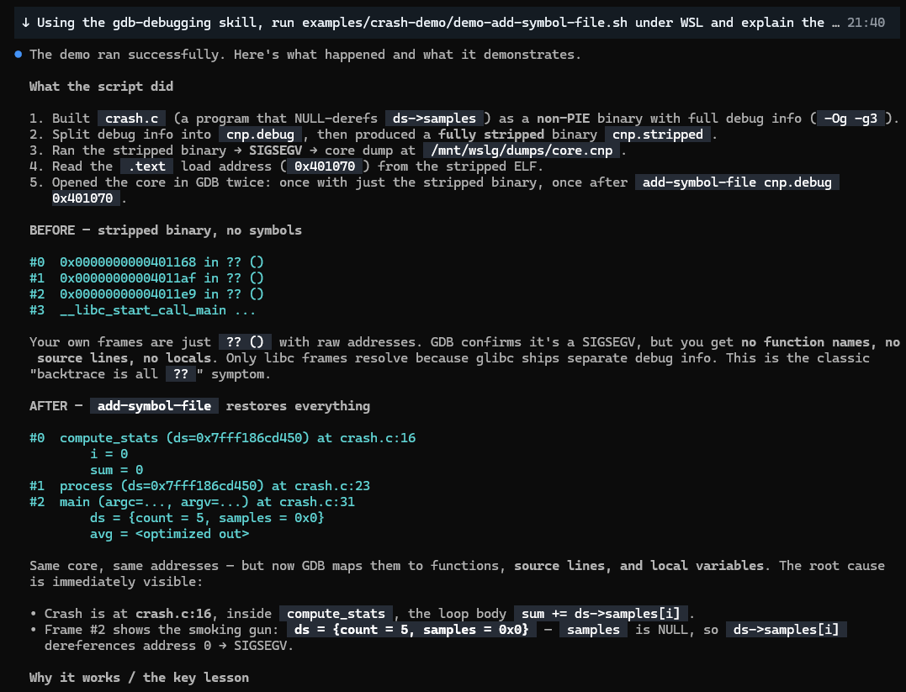

# gdb-debugging skill

An on-demand **agent skill** that turns your coding agent into a GDB expert for triaging and
root-causing native crashes: core dumps, kernel oops/panics, segfaults, memory corruption,
deadlocks/hangs, and remote/embedded targets. Works for **C, C++, Rust, Go, and mixed** binaries.

## What's inside

```
gdb-debugging/
├── SKILL.md                     # entry point: triage flow + golden rules
├── references/
│   ├── core-dumps.md            # post-mortem core analysis
│   ├── kernel-oops.md           # oops/panic decode + vmcore/crash utility
│   ├── live-debugging.md        # attach, breakpoints, reverse/rr
│   ├── memory-corruption.md     # SIGSEGV, UAF, double-free, overflows, poison bytes
│   ├── deadlocks-hangs.md       # thread stacks, lock ownership, spin vs block
│   ├── remote-embedded.md       # gdbserver, cross, KGDB, QEMU, JTAG/OpenOCD
│   ├── agent-automation.md      # drive gdb from an agent/CLI: batch, interactive, MI, WSL
│   └── gdb-cheatsheet.md        # command reference + per-language setup
└── scripts/
    ├── triage.gdb               # one-shot crash summary (gdb -x)
    ├── triage-core.sh           # batch a directory of cores into reports
    └── gdbinit-recommended      # sane ~/.gdbinit defaults + custom commands
```

## How agents use it

When you describe a crash/dump/hang, the agent loads `SKILL.md`, follows the triage decision flow,
and pulls in only the relevant reference file. The scripts are runnable directly.

## Requirements / environment

- **GDB** (`gdb`), and for cross/kernel work `gdb-multiarch`. For heap bugs, `valgrind`/ASan help.
- The binary's **debug info** (`-g`), or matching `-dbgsym`/`debuginfo` packages / `debuginfod`.
- **On Windows**, Linux core dumps need **Linux GDB** — run everything under **WSL**.
  A Windows-native (MinGW) gdb cannot read a Linux ELF core.
  ```powershell
  # from PowerShell, drive Linux gdb via WSL:
  wsl gdb --batch -x scripts/triage.gdb ./app ./core
  ```
  The agent does this automatically; see [references/agent-automation.md](references/agent-automation.md).

## Try it in the GitHub Copilot CLI

The [GitHub Copilot CLI](https://docs.github.com/copilot/github-copilot-cli) reads the **same skill
format**, so you can use this skill from your terminal.

**Option A — inside the repo (workspace scope).** The CLI auto-discovers `.github/skills/`:
```powershell
cd <repo-with-this-skill>
copilot
# then ask, e.g.:  "analyze the core at examples/crash-demo/core with binary examples/crash-demo/crash"
```

**Option B — install personally (available everywhere).** Copy the folder into `~/.copilot/skills/`:
```powershell
Copy-Item -Recurse .github/skills/gdb-debugging "$HOME/.copilot/skills/gdb-debugging"
```

**One-shot / non-interactive:**
```powershell
copilot -p "Using the gdb-debugging skill, run examples/crash-demo/demo-add-symbol-file.sh under WSL and explain the before/after"
```

Notes:
- Approve the terminal commands when prompted (or start with `copilot --allow-all-tools` if you trust the flow).
- On Windows the CLI must call `wsl gdb ...` for Linux cores — the skill already instructs this.
- `gh copilot suggest/explain` is a *different* tool (command suggestions, not agentic skill execution);
  use the standalone `copilot` CLI for this skill.

## Example: real GDB output

Running the bundled [examples/crash-demo/demo-add-symbol-file.sh](examples/crash-demo/demo-add-symbol-file.sh)
through the Copilot CLI drives real GDB and recovers a symbol-less backtrace with `add-symbol-file`:



The actual GDB text it produced:
```text
########## BEFORE: stripped binary, no symbols ##########
#0  0x0000000000401168 in ?? ()
#1  0x00000000004011af in ?? ()
#2  0x00000000004011e9 in ?? ()
#3  __libc_start_call_main ...

########## AFTER: add-symbol-file cnp.debug 0x401070 ##########
#0  compute_stats (ds=ds@entry=0x7fff186cd450) at crash.c:16
        i = 0
        sum = 0
#1  process (ds=ds@entry=0x7fff186cd450) at crash.c:23
#2  main (argc=<optimized out>, argv=<optimized out>) at crash.c:31
        ds = {count = 5, samples = 0x0}      # <-- root cause: samples is NULL
        avg = <optimized out>
```
Same core, same addresses — but after attaching the split debug file, GDB maps them to functions,
source lines (`crash.c:16`), and locals, exposing the NULL `samples` that caused the SIGSEGV.

## Install

Pick a location the agent scans (see the
[VS Code agent skills docs](https://code.visualstudio.com/docs/copilot/customization/agent-skills)):

**Project (team-shared)** — commit into a repo:
```
<repo>/.github/skills/gdb-debugging/
```

**Personal (all your workspaces):**
```
~/.copilot/skills/gdb-debugging/     # or ~/.agents/skills/  or  ~/.claude/skills/
```

Copy the whole `gdb-debugging/` folder (keep the structure intact).

## Use the scripts standalone

```bash
# One core:
gdb --batch --nx -x scripts/triage.gdb ./app ./core > triage.txt

# A directory of cores:
scripts/triage-core.sh ./app /var/crash ./reports

# Better defaults for every session:
cp scripts/gdbinit-recommended ~/.gdbinit
```

## Publishing to GitHub

This folder is self-contained and safe to publish. To share it broadly:

1. Put the `gdb-debugging/` folder at the repo root (or under `.github/skills/`).
2. `chmod +x scripts/triage-core.sh` before committing so it stays executable.
3. Add a license (MIT is common for skills) and this README at the repo root.

## Scope

Native code with a GDB backend. **Not** for pure Python/Java/JavaScript (use their own debuggers).
Cores contain process memory (secrets/PII) — handle and share them carefully.
